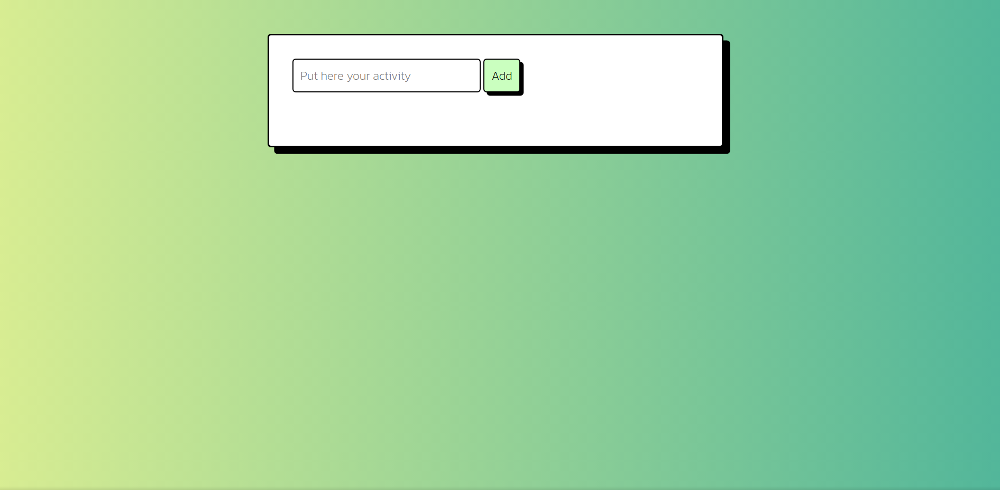
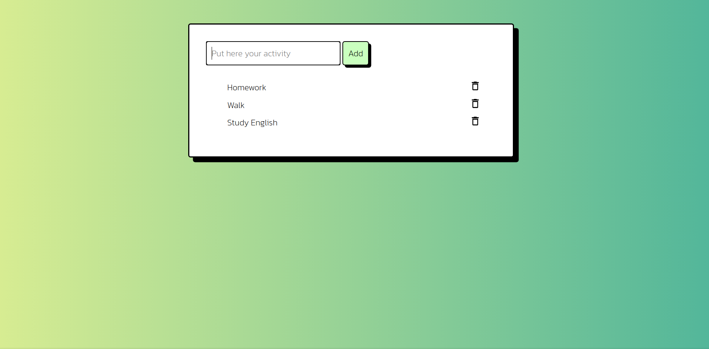
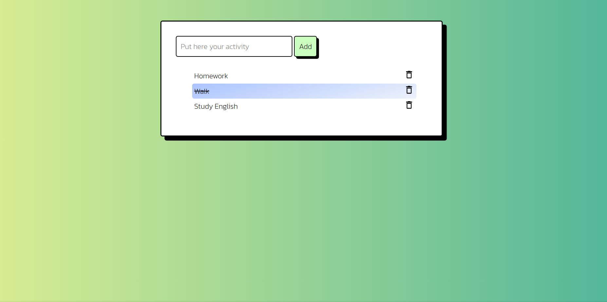
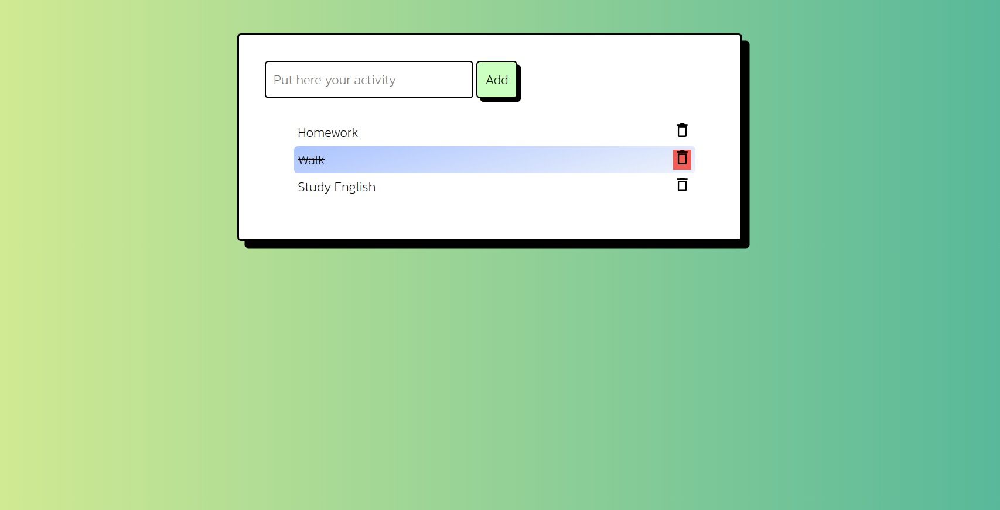
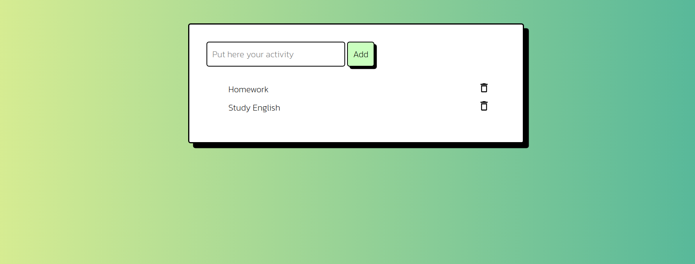

# :page_facing_up: To-Do List

Lista de afazeres, feito em JavaScript.

# :memo: Como Usar
* Adicionar atividades;
    * Coloque o nome da atividade, em seguida clique em 'Add'.

* Marcar atividades como feitas;
    * Basta apenas clicar sobre a atividade que deseja marcar.

* Remover Atividades.
    * Clique no icone de lixeira no canto direito da atividade.

>Imagens do Projeto Atualmente, pode haver mudança de layout. Projeto feito para fins didáticos.
